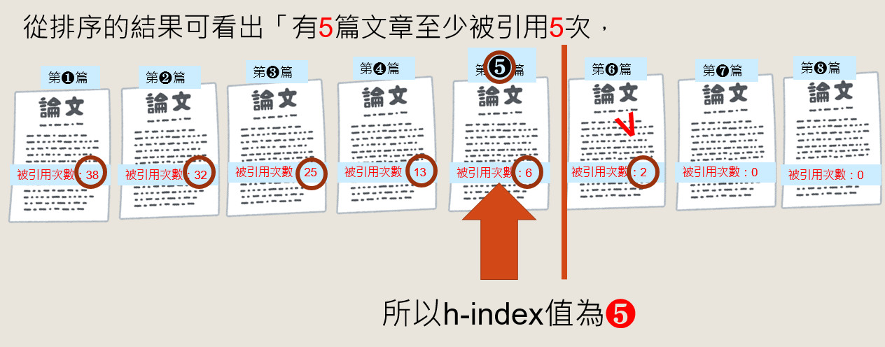
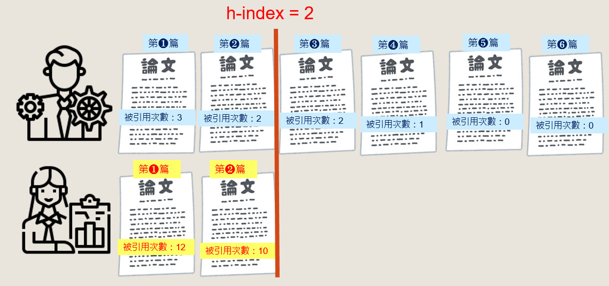

# Resolution
> 覺得題目描述 “where `citations[i]` is the number of citations a researcher received for their `ith` paper”，這裡的描述不是很恰當，因為並沒有第 0 篇論文，如果 `citations[i]` 改成 `citations[i-1]` 會比較適合。

## 什麼是 h-index? [1]
期刊論文被引用的次數 (Time Cited)，可以反映這篇論文對之後研究的影響程度。一般而言，引用次數愈高者，表示有愈多人參考引用這篇文章，其影響也就愈深遠。除了觀察引用次數的高低、計算引用次數的平均值 (Average Citation) 之外，還可以利用 h-index 得知某一作者、機構整體論文發表的質與量喔！

J.E. Hirsch 於 2005 年提出統計指標 h-index (註1)，h-index 的計算方法是將被引用的文章按照引用次數排序，引用次數高的排在最前面，引用次數少的排在最後，從排序的結果可看出被引用的文章「有h篇文章至少被引用h次」。

## 解法概念
有 h 篇文章至少被引用 h 次，並找出 h 的最大值
1. 由高而低排序
2. 由高而低的搜尋，看在第 h 篇文章時，h 低於該篇文章的引用次數

- 解法一：linear search
  - Time Complexity: O(NlogN + N), NlogN for sorting, N for seaching
- 解法二：binary search
  - Time Complexity: O(NlogN + logN), NlogN for sorting, logN for seaching

## Reference
[1] http://tul.blog.ntu.edu.tw/archives/2485